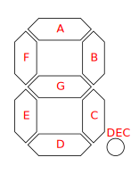

# ATMEGA8A Tutorial Board A

| Revision | Description                                                                                                                                                                                                                                                                                                |
| -------- | ---------------------------------------------------------------------------------------------------------------------------------------------------------------------------------------------------------------------------------------------------------------------------------------------------------- |
| 1.0      | <ul><li>Completed initial design of evaluation board.</li></ul>                                                                                                                                                                                                                                            |
| 1.1      | <ul><li>Added series resistor to external reset for MCU.</li><li>Added series resistor to potentiometer for short-circuit protection.</li><li>Added series resistor to NE555 output for short-circuit protection.</li><li>Updated ISP-10 footprint to ISP-6.</li><li>Updated resistor footprint.</li></ul> |
| 1.2      | TBD                                                                                                                                                                                                                                                                                                        |

## Getting Started

### Prerequisites

```bash
# install build tools
sudo apt-get install binutils gcc-avr avr-libc uisp avrdude flex byacc bison
```

### Building

Execute the following commands in the `software-design` folder,

```bash
# Windows 10
cmake --preset default
cmake --build . --preset default
# Ubuntu
cmake --preset default
cmake --build --preset default
```

### Targets

After building the `default` preset the following targets will be made available in the generated makefile,

```bash
# flash command for a simple blink program
make flash-blink-sync
make disassemble-blink-sync

# enables the use of an external 16MHz clock source
make fuse
```

## 7 Segment

| Diagram                                                         | Description                                                                                                                                                                                                                                                                                                                                                                    |
| --------------------------------------------------------------- | ------------------------------------------------------------------------------------------------------------------------------------------------------------------------------------------------------------------------------------------------------------------------------------------------------------------------------------------------------------------------------ |
|  | <ul><li>The 7-segment display uses all of Port D for setting the individual segments</li><li>The lower nibble of Port C is used to multiplex the currently active digit</li><li>The digits are numbered from left to right when the decimal point is positioned correctly relative to the users point of view</li><li>All segments and selection pins are active low</li></ul> |

| Microcontroller | D0  | D1  | D2  | D3  | D4  | D6  | D7  | C0      | C1      | C2      | C3      |
| --------------- | --- | --- | --- | --- | --- | --- | --- | ------- | ------- | ------- | ------- |
| 7-segment       | F   | C   | A   | G   | B   | E   | DEC | Digit 1 | Digit 2 | Digit 3 | Digit 4 |

| Value | D0  | D1  | D2  | D3  | D4  | D5  | D6  | D7  | HEX  |
| ----- | --- | --- | --- | --- | --- | --- | --- | --- | ---- |
| 0     | 0   | 0   | 0   | 1   | 0   | 0   | 0   | 1   | 0x88 |
| 1     | 1   | 0   | 1   | 1   | 0   | 1   | 1   | 1   | 0xED |
| 2     | 1   | 1   | 0   | 0   | 0   | 0   | 0   | 1   | 0x83 |
| 3     | 1   | 0   | 0   | 0   | 0   | 0   | 1   | 1   | 0xC1 |
| 4     | 0   | 0   | 1   | 0   | 1   | 1   | 1   | 1   | 0xE4 |
| 5     | 0   | 0   | 0   | 1   | 1   | 0   | 1   | 1   | 0xD0 |
| 6     | 0   | 0   | 0   | 1   | 1   | 0   | 0   | 1   | 0x90 |
| 7     | 1   | 0   | 0   | 1   | 0   | 1   | 1   | 1   | 0xE9 |
| 8     | 0   | 0   | 0   | 0   | 0   | 0   | 0   | 1   | 0x80 |
| 9     | 0   | 0   | 0   | 0   | 0   | 1   | 1   | 1   | 0xE0 |

## Specifications

### Rev 1.0

| Top                                     | Bottom                                        |
| --------------------------------------- | --------------------------------------------- |
|  |  |

### Rev 1.1

| Top                                     | Bottom                                        |
| --------------------------------------- | --------------------------------------------- |
|  |  |

### Rev 1.2

Reserved for future use.
